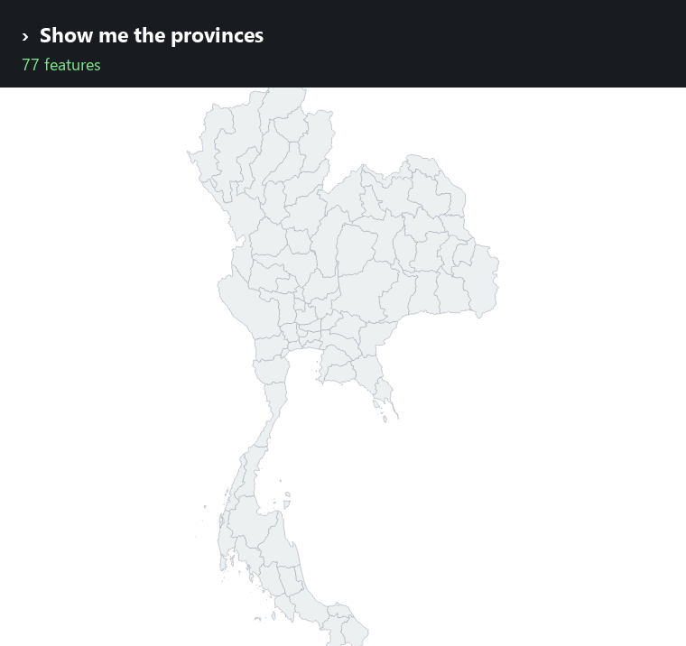
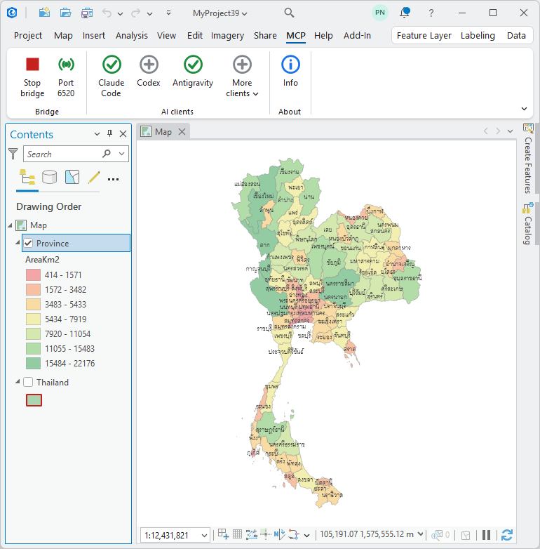
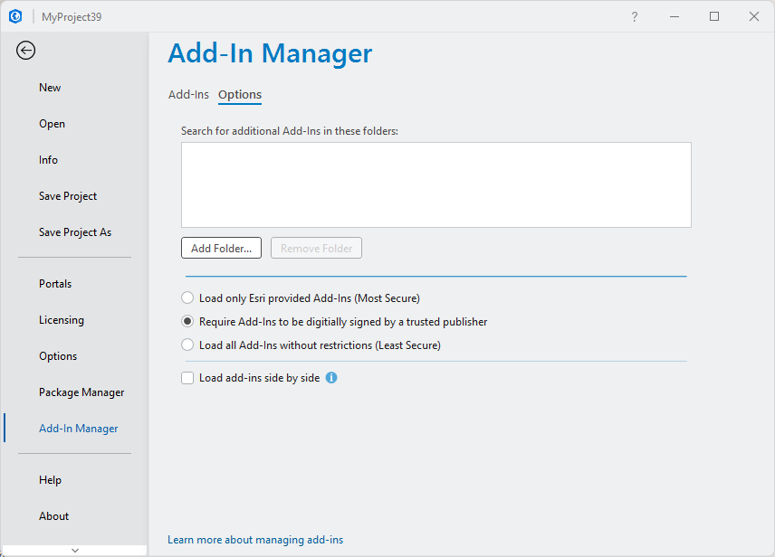

# ArcGIS Pro MCP

**An ArcGIS Pro add-in that lets you say what you want.**

It implements the [Model Context Protocol](https://modelcontextprotocol.io)
inside ArcGIS Pro itself, so an AI assistant — Claude, Codex, Antigravity, or
any other MCP client — can work on the project already open in front of you.
Your data, your maps, your layouts. Not a copy, not an export.

**Install the add-in, click the button for the assistant you use, done.** No
config files to find, no JSON to hand-edit, no Python to install.

**In any language your assistant speaks.** Your assistant does the
understanding; this add-in never matches on English keywords. Non-English text
travels intact in both directions, so a query can name a place in Thai and get
Thai back — `PROV_NAMT LIKE '%เชียง%'` returns เชียงใหม่ and เชียงราย.

```text
"Style the provinces by area, pastel red through green"
"Which province has the highest population? Put the answer in a new field"
"Export the current map view as a PNG and show me"
```

```text
"ระบายสีจังหวัดตามขนาดพื้นที่ ไล่จากแดงพาสเทลไปเขียว"
"จังหวัดไหนมีประชากรมากที่สุด ใส่คำตอบไว้ในคอลัมน์ใหม่"
"ส่งออกมุมมองแผนที่ปัจจุบันเป็น PNG แล้วเอามาให้ดู"
```

The aim is the whole of ArcGIS Pro, not a convenient corner of it. A request
falls through three layers, and takes the fastest one that can answer it:

| | | |
|---|---|---|
| **1** | **116 named tools**, written in C# | Layers, attributes, selections, symbology, layouts, rasters, editing — the work of an ordinary day. 109 of them execute inside ArcGIS Pro's own process, in about **9 ms** each. |
| **2** | **Every geoprocessing tool** | `run_geoprocessing_tool` runs any of Pro's ~2,000 tools by name, with named parameters rather than a positional list to miscount. Still in-process, still C#. |
| **3** | **Arbitrary arcpy** | `execute_arcpy_code` hands Python straight to arcpy in the running application. Whatever the layers above have no tool for, this reaches. |

Layers 1 and 2 need nothing but the add-in. Layer 3 runs through an optional
Python bridge inside ArcGIS Pro's own Python — install it when you want the
escape hatch, skip it and the first two still work. A command the add-in does
not implement is forwarded there automatically; if it is not running, the
error says so and how to start it, rather than failing obscurely.

The practical effect is that there is no such thing as "the tool for that is
missing". If it can be done in ArcGIS Pro, it can be asked for in a sentence.



*Every frame above was rendered by the add-in itself, running the request in
the caption. Rebuild it with `python scripts/make_demo_gif.py`.*



---

## Install

Get it from the
**[latest release](https://github.com/Knight60/ArcGIS-Pro-MCP/releases/latest)**
and pick one of the two files.

### The add-in on its own

Download
**[`ArcGISProMCP.esriAddinX`](https://github.com/Knight60/ArcGIS-Pro-MCP/releases/latest/download/ArcGISProMCP.esriAddinX)**
and double-click it. ArcGIS Pro's own installer takes it from there. Restart
Pro and the **MCP** tab appears.

### Or the installer, if that does not work

**[`Install-ArcGISProMCP.cmd`](https://github.com/Knight60/ArcGIS-Pro-MCP/releases/latest/download/Install-ArcGISProMCP.cmd)**
is one self-contained file — the add-in is inside it, so there is nothing else
to download.

Double-click it, or run it from a prompt. It is a `.cmd`, not a `.ps1`, so
Windows' script execution policy never gets in the way.

Use this one when Pro loads the add-in but the MCP tab never appears: some
machines have add-in security turned on, and the add-in alone cannot say so.
The installer checks, tells you which of the two states it found, and offers
the fix. Run it a second time and it offers to uninstall.

Requires ArcGIS Pro 3.3+. Nothing else — no Python, no SDK, no admin rights.

<details>
<summary>Or the build straight off <code>main</code></summary>

The same two files are also committed to
[`dist/`](https://github.com/Knight60/ArcGIS-Pro-MCP/tree/main/dist), which is
the build the current source produces. Between releases it can be ahead of the
latest release — a fix that is committed but not yet tagged will be there first.

They are committed rather than left as build output because GitHub Actions has
no ArcGIS Pro to build against: a build only exists if someone with Pro
installed produces it. Committing it keeps a download beside the source that
made it.

Take the release unless you have a reason to want something newer than it.

</details>

### Uninstalling

Run the installer again and answer yes, or:

```powershell
Install-ArcGISProMCP.cmd -Uninstall
```

It removes every copy it finds, including the one ArcGIS Pro's own installer
unpacks into a folder named after the add-in id. The `.esriAddinX` cannot
uninstall anything — double-clicking it only ever installs. The other way is
ArcGIS Pro itself: **Project ▸ Add-In Manager ▸ Delete this Add-In**.

---

## Connect an AI client

Open the **MCP** tab in ArcGIS Pro and click your assistant — the three most
used are on the ribbon, the rest are under **More clients**.

| Icon | Meaning |
|---|---|
| ✓ green | that client already has the server — click to remove it |
| ⊕ grey | click to add it |
| greyed out | that client is not installed |

It asks before changing anything, tells you which file it will write, and backs
that file up first.

Supported: **Claude Code, Codex, Antigravity, VS Code, Cursor, Cline, Gemini
CLI, Claude Desktop.**

<details>
<summary>Or configure it by hand</summary>

Most clients connect over HTTP:

```powershell
claude mcp add --transport http arcgis http://127.0.0.1:6520/mcp
```

```json
{ "mcpServers": { "arcgis": { "type": "http", "url": "http://127.0.0.1:6520/mcp" } } }
```

Antigravity wants `serverUrl` instead of `url` and no `type`.

Codex and Claude Desktop launch a server rather than connecting to one, so they
need the Python relay. It is not on PyPI yet; install it from this repository:

```powershell
pip install git+https://github.com/Knight60/ArcGIS-Pro-MCP
```

That puts `arcgis-pro-mcp.exe` on your PATH, which is what those two clients
should be pointed at. The ribbon buttons do this for you and will say so if the
relay is missing.

</details>

The bridge lives inside ArcGIS Pro, so **Pro has to be open**. Close it and the
client's connection goes red.

---

## The ribbon

**One button starts and stops**, the way a play button does: the icon shows
what the next click will do, so it doubles as the state readout. Green ▶ means
stopped, red ⏹ means running.

**Status** shows a green broadcast while listening and a contained grey dot
when not, with the port as its caption. Click it for the full report: requests
served, which clients are connected, and the last error.

---

## Tools

<!-- TOOLS:START -->

**116 tools.** Anything not listed is still reachable through `run_geoprocessing_tool` or `execute_arcpy_code`.

### Session and project (14)

| Tool | What it does |
|---|---|
| `ping` | Check that the ArcGIS Pro bridge is reachable and see which project it is attached to |
| `get_capabilities` | List every command the connected bridge supports, grouped by area |
| `diagnose` | Self-check the connection: ArcGIS Pro version, licence, open project, active map, open map view and write access |
| `get_arcgis_info` | ArcGIS Pro version, licence level, available extensions and the current project path |
| `get_project_info` | Project paths, default geodatabase and toolbox, maps, layouts, folder and database connections |
| `save_project` | Save the ArcGIS Pro project (.aprx), or save a copy elsewhere |
| `list_maps` | List all maps and scenes with coordinate system and layer counts |
| `create_map` | Create a new map or scene in the project |
| `remove_map` ⚠️ | Delete a map from the project |
| `activate_map` | Open/activate a map's view in the ArcGIS Pro UI |
| `set_map_properties` | Rename a map or change its coordinate system |
| `get_map_extent` | The combined extent of all data layers in a map |
| `get_environment` | Read the current arcpy geoprocessing environment settings |
| `set_environment` | Set arcpy geoprocessing environment settings such as workspace, outputCoordinateSystem, extent, mask, cellSize, overwriteOutput or parallelProcessingFactor |

### Layer (19)

| Tool | What it does |
|---|---|
| `get_layers` | List the layers (with draw order and group nesting) and standalone tables in a map |
| `get_layer_info` | Full detail for one layer: data source, coordinate system, extent, fields, feature count, renderer and label state |
| `add_layer` | Add data to a map from a path or service URL: feature class, shapefile, raster, table, .lyrx layer file or web service |
| `add_web_layer` | Add a web service layer (Feature/Map/Image service, WMS, WMTS, vector tile) by URL |
| `remove_layer` ⚠️ | Remove a layer or standalone table from a map |
| `rename_layer` | Rename a layer in the table of contents |
| `duplicate_layer` | Copy a layer within the map so it can be symbolised differently |
| `set_layer_visibility` | Show or hide one layer, several layers, or every layer in the map |
| `set_layer_transparency` | Set layer transparency (0 = opaque, 100 = fully transparent) |
| `set_layer_scale_range` | Limit the scale range a layer draws at |
| `set_definition_query` | Set a layer's definition query (SQL where clause) |
| `move_layer` | Reorder a layer relative to another, or move it into a group layer |
| `create_group_layer` | Create a group layer, optionally moving existing layers into it |
| `zoom_to_layer` | Zoom the map view to a layer's extent |
| `set_basemap` | Set the basemap: Topographic, Imagery, Imagery Hybrid, Streets, Navigation, Light Gray Canvas, Dark Gray Canvas, Terrain, Oceans, OpenStreetMap, National Geographic Style Map |
| `get_broken_layers` | List layers across all maps whose data source is missing |
| `repair_layer_source` | Repoint a layer at a new workspace or dataset to fix a broken source |
| `add_join` | Join a table to a layer on a common field |
| `remove_join` | Remove a join from a layer |

### Attributes and editing (11)

| Tool | What it does |
|---|---|
| `get_features` | Read attribute rows from a layer, table or dataset path, with an optional where clause, field subset, ordering and WKT geometry |
| `count_features` | Count features, optionally matching a where clause |
| `get_unique_values` | Distinct values of a field with the count of rows for each |
| `get_field_statistics` | min / max / mean / median / sum / standard deviation of a numeric field |
| `summarize_features` | Group rows by one or more fields and aggregate -- the fast way to answer 'how many / how much per category' without geoprocessing |
| `insert_features` | Insert new rows into a layer or table |
| `update_features` ⚠️ | Update attributes and/or geometry of rows matching a where clause |
| `delete_features` ⚠️ | Delete rows matching a where clause |
| `save_edits` | Commit pending edits |
| `discard_edits` | Throw away pending edits |
| `calculate_field` | Calculate field values across a layer, e.g |

### Selection (6)

| Tool | What it does |
|---|---|
| `select_features` | Select features by SQL where clause |
| `select_by_location` | Select features by spatial relationship to another layer |
| `get_selection` | Report what is currently selected, per layer, with ObjectIDs and optionally the attribute rows |
| `set_selection` | Select specific features by ObjectID |
| `clear_selection` | Clear the selection on one layer, or on every layer in the map |
| `zoom_to_selection` | Zoom the map view to the currently selected features |

### Schema and dataset creation (11)

| Tool | What it does |
|---|---|
| `list_fields` | List a layer's fields with type, alias, length and domain |
| `add_field` | Add a field to a layer or table |
| `add_fields` | Add several fields in one call |
| `delete_field` ⚠️ | Delete one or more fields |
| `alter_field` | Rename a field or change its alias/length |
| `create_feature_class` | Create an empty feature class, by default in the project's default geodatabase, and add it to the map |
| `create_table` | Create an empty standalone table |
| `create_file_geodatabase` | Create a new file geodatabase |
| `truncate_table` ⚠️ | Delete every row from a table or feature class, keeping the schema |
| `delete_dataset` ⚠️ | Delete a dataset from disk or a geodatabase |
| `export_features` | Export a layer -- honouring its current selection and definition query -- to a new dataset |

### Geoprocessing (7)

| Tool | What it does |
|---|---|
| `run_geoprocessing_tool` | Run any arcpy geoprocessing tool -- the universal escape hatch for analysis |
| `list_geoprocessing_tools` | Search the available geoprocessing tools by name |
| `list_toolboxes` | List the arcpy toolbox modules and any toolboxes in the project |
| `describe_geoprocessing_tool` | Get a tool's parameters, data types, defaults and usage text before running it |
| `run_python_toolbox_tool` | Run a tool from a custom .pyt / .atbx / .tbx toolbox on disk |
| `check_extension` | Check, and optionally check out, an ArcGIS extension licence |
| `get_messages` | Messages from the most recent geoprocessing operation |

### Symbology and labels (6)

| Tool | What it does |
|---|---|
| `set_layer_renderer` | Change a layer's symbology: a single symbol, unique values by category, or a classified/continuous colour scheme by numeric field |
| `get_layer_symbology` | Inspect a layer's current renderer, class breaks, unique values and label settings |
| `list_color_ramps` | List the colour ramps available in the project |
| `set_layer_labeling` | Turn labels on or off and set the expression, font and halo |
| `apply_symbology_from_layer` | Copy symbology from a .lyrx file or another layer |
| `save_layer_file` | Save a layer with its symbology to a .lyrx file for reuse |

### Map view and bookmarks (7)

| Tool | What it does |
|---|---|
| `get_map_view` | Current camera position: centre, scale, rotation and visible extent |
| `set_map_view` | Move the map view: set an extent, a centre point, a scale and/or a rotation |
| `export_map_view` 🖼️ | Render the map view to PNG and return the image so it can be looked at -- the way to visually check a map |
| `list_bookmarks` | List the spatial bookmarks defined on a map |
| `create_bookmark` | Save the current view, or a given extent, as a named bookmark |
| `apply_bookmark` | Zoom the map view to a bookmark |
| `delete_bookmark` ⚠️ | Delete a bookmark from a map |

### Layouts and printing (16)

| Tool | What it does |
|---|---|
| `list_layouts` | List the print layouts with page size and element counts |
| `get_layout_info` | Inspect a layout: page setup and every element with position and size |
| `create_layout` | Create a new layout page, by default with a map frame filling it |
| `delete_layout` ⚠️ | Delete a layout from the project |
| `add_map_frame` | Add a map frame to a layout at a page position |
| `set_map_frame_extent` | Point a layout's map frame at a layer, an extent or a scale |
| `add_layout_text` | Add a text element such as a title or credits to a layout |
| `add_layout_legend` | Add a legend tied to a layout's map frame |
| `add_layout_scale_bar` | Add a scale bar tied to a layout's map frame |
| `add_layout_north_arrow` | Add a north arrow tied to a layout's map frame |
| `add_layout_picture` | Place an image such as a logo on a layout |
| `set_layout_element` | Move, resize, rename, hide or change the text of any layout element |
| `delete_layout_element` ⚠️ | Remove an element from a layout |
| `export_layout` 🖼️ | Export a layout to PDF / PNG / JPEG / SVG / TIFF |
| `preview_layout` 🖼️ | Render a layout to a temporary image and return it, without writing a file -- use it to visually check a layout while building it |
| `export_map_series` | Export a layout's map series (map book) to a multi-page PDF |

### Raster (5)

| Tool | What it does |
|---|---|
| `get_raster_info` | Raster detail: bands, size, cell size, pixel type, statistics and CRS |
| `set_raster_symbology` | Set a raster layer's colorizer and colour ramp |
| `raster_calculator` | Map algebra |
| `sample_raster_values` | Read raster cell values at map coordinates or at a point layer's features |
| `zonal_statistics` | Summarise raster values inside zone polygons and return the table |

### Finding and inspecting data (6)

| Tool | What it does |
|---|---|
| `list_workspace_contents` | List the datasets inside a geodatabase or folder |
| `list_folder` | List GIS files and subfolders on disk |
| `describe_dataset` | Describe any dataset by path -- type, geometry, CRS, extent, fields and row count -- without adding it to a map |
| `search_data` | Find datasets by name across the project's geodatabase, home folder and folder connections |
| `get_project_items` | Folder connections, database connections and toolboxes registered in the project |
| `add_folder_connection` | Register a folder with the project so its data is easy to browse |

### Metadata (4)

| Tool | What it does |
|---|---|
| `get_metadata` | Read a dataset's metadata record: style, title, summary, description, tags, credits and access/use constraints |
| `set_metadata` ⚠️ | Write metadata fields on a dataset or geodatabase, optionally upgrading the record to ISO 19139 first; field names in English or Spanish |
| `export_metadata_iso19139` | Export a dataset's metadata record to an ISO 19139 XML file |
| `set_metadata_from_table` ⚠️ | Apply metadata to one or many datasets from a CSV/XLSX reference table |

### Escape hatch (4)

| Tool | What it does |
|---|---|
| `execute_arcpy_code` | Run Python inside ArcGIS Pro |
| `get_pump_status` | Whether the main-thread dispatcher is installed |
| `stop_pump` | Remove the main-thread dispatcher |
| `run_batch` | Run several commands in one round trip -- much faster for multi-step workflows |

⚠️ = changes or deletes real data &nbsp;&nbsp; 🖼️ = returns an image the AI can look at

<!-- TOOLS:END -->

---

## Troubleshooting

**No MCP tab after restarting Pro.** Add-in security is the usual cause.
Run `Install-ArcGISProMCP.cmd`; it will say so and offer the two ways round it.
The setting itself is in ArcGIS Pro under **Project ▸ Add-In Manager ▸
Options**:



The middle setting is the one this add-in is signed for. The bottom one loads
anything. [What each choice means](docs/addin.md#signing-the-add-in).

**The client shows the server in red.** ArcGIS Pro is closed, or the bridge is
stopped. Open Pro and check the toggle on the MCP tab shows ⏹ (running).

**A command says a layer does not exist.** Layers inside a group need their
full name, `"Group\Layer"`, for anything that runs through geoprocessing.

**An edit did not appear.** ArcGIS Pro holds edits open so they can be undone,
which also keeps the data locked. Call `save_edits`.

---

## Safety

These tools change the project you have open and the data under it. Tools
marked ⚠️ above modify or delete real data.

The bridge binds to `127.0.0.1` only — nothing on the network can reach it —
but anything that can run code on your machine can drive ArcGIS Pro through it
while Pro is open. `execute_arcpy_code` runs arbitrary Python inside Pro.

Prefer non-destructive steps, use `save_project` deliberately, and let the
assistant confirm before bulk edits.

---

## How it works

An ArcGIS Pro add-in written in C#, running inside Pro's own process:

```text
AI client ──MCP over HTTP :6520/mcp ─┐
                                     │
AI client ──MCP stdio──► arcgis-pro-mcp ──TCP :6510──┐
                                     │               │
                                     ▼               ▼
              ┌─ C# add-in (inside the ArcGIS Pro process) ─┐
              │   → QueuedTask.Run (Main CIM Thread)        │
              │   anything it does not implement ─┐         │
              └───────────────────────────────────┼─────────┘
                                                  ▼ :6511
                                    Python bridge (execute_arcpy_code)
```

Being in-process is the whole point. ArcGIS Pro will only let its own Main CIM
Thread touch the open project, and an outside process cannot get onto it. An
earlier all-Python version had to hand work to Pro's Python thread and wait,
which took around 28 seconds per call. The add-in uses `QueuedTask.Run`
directly: **9 ms**.

Seven of the 116 tools stay on the Python side, and belong there:
`execute_arcpy_code`, because a compiled add-in cannot run code composed at
call time, `get_pump_status` / `stop_pump`, which report on the Python
bridge's own dispatcher, and the metadata tools (`get_metadata`,
`set_metadata`, `export_metadata_iso19139`, `set_metadata_from_table`), which
live on `arcpy.metadata`.

More detail in [docs/](docs/).

---

## Building it yourself

You do not need to — the release is a single download. If you want to change
something, see **[BUILD.md](BUILD.md)**.

```powershell
.\scripts\build.ps1
```

Everything used to produce a release is in this repository: the build, the
signing, the icon drawing, and the installer that gets packed into one file.

---

## Author and licence

Built by **Pisut Nakmuenwai** ([@Knight60](https://github.com/Knight60)).

Dual licensed.

**[AGPL-3.0](LICENSE)** — free, and free to keep. Use it for your own work,
paid or unpaid, on as many machines as you like. Modify it. Build on it. The
one condition is reciprocal: if you pass on a work built from this one, or run
it as a service other people use, those people get its source under the same
terms.

**[Commercial](COMMERCIAL-LICENSE.md)** — for shipping it inside a product you
do not publish the source of, hosting it in a closed service, or redistributing
it under your own name.

Doing GIS work with it and delivering the maps and analysis is ordinary use,
not distribution. Most people never need the second licence;
[the details](COMMERCIAL-LICENSE.md) say where the line falls, and asking is
free.

Releases up to v1.0 were MIT and stay MIT — that grant cannot be withdrawn. The
dual licence applies from v1.1. [NOTICE](NOTICE) carries the copyright and an
AGPL Section 7 permission for linking with the ArcGIS Pro SDK.

---

## Support this project

Built and maintained in the open, with no company behind it.

If it saves you time, **[sponsoring it](https://github.com/sponsors/Knight60)**
helps keep it working. Most of the ongoing effort is not new features but
keeping up with ArcGIS Pro: every release can move the framework it targets and
shift the parameter order of its two thousand geoprocessing tools, and each one
means regenerating that table and testing the whole surface again.

Starring the repository costs nothing and helps other people find it. So does
telling me what broke — a clear
[issue](https://github.com/Knight60/ArcGIS-Pro-MCP/issues) is worth a great
deal.

---

## Disclaimer

This software is provided **"as is", without warranty of any kind**, express or
implied, including but not limited to the warranties of merchantability,
fitness for a particular purpose, and non-infringement. In no event shall the
author or copyright holder be liable for any claim, damages, or other
liability, whether in an action of contract, tort, or otherwise, arising from
or in connection with the software or its use. The full terms are in
[LICENSE](LICENSE).

Two properties of this software deserve stating plainly rather than being left
to the licence, because they are what it is for rather than defects in it:

- It **executes commands against a live ArcGIS Pro session**, including
  operations that permanently alter or delete datasets, project files, and
  geodatabase contents. The tools marked ⚠️ in the table above are the ones
  that do so.
- Those commands are **issued by an AI assistant**, whose output is not
  deterministic and is not reviewed before it runs. `execute_arcpy_code`
  executes arbitrary Python inside ArcGIS Pro with the privileges of the
  signed-in user.

You remain responsible for your data and for the consequences of any operation
performed through this software. Back up anything you cannot afford to lose,
work on copies where practical, and verify results before relying on them. Use
against production data, or against data you cannot restore, is entirely at
your own risk.

This project is an independent work. It is **not affiliated with, endorsed by,
sponsored by, or supported by Esri**, and it is not a supported ArcGIS product.
ArcGIS and ArcGIS Pro are trademarks of Esri. Your use of ArcGIS Pro remains
governed by your own licence agreement with Esri, and nothing here modifies it.
